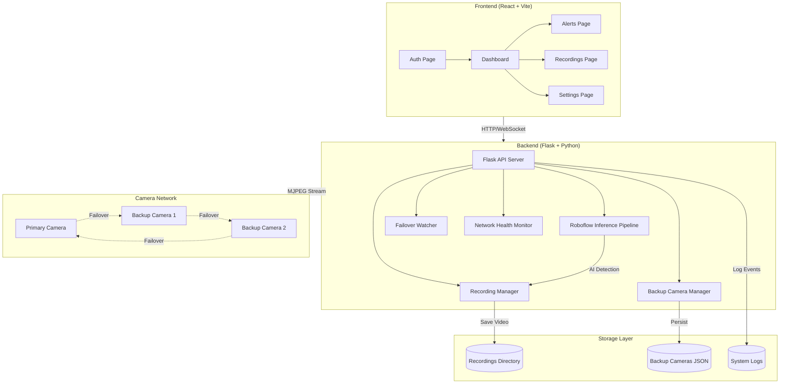

# SentinelVision AI - Technical Documentation

## Table of Contents
1. [Project Overview](#project-overview)
2. [System Architecture](#system-architecture)
3. [Technology Stack](#technology-stack)
4. [Project Structure](#project-structure)
5. [Backend API Documentation](#backend-api-documentation)
6. [Frontend Architecture](#frontend-architecture)
7. [Key Features](#key-features)
8. [Data Flow](#data-flow)
9. [Configuration](#configuration)
10. [Deployment](#deployment)

---

## Project Overview

**SentinelVision AI** is a real-time AI-powered security surveillance system with automatic camera failover capabilities. The system monitors video feeds using AI object detection (Roboflow YOLO), automatically detects threats, records incidents, and seamlessly switches between multiple camera sources when failures occur.

### Key Capabilities
- **Real-time AI Object Detection** using Roboflow Inference SDK
- **Automated Threat Detection & Recording** (knife, gun, weapon detection)
- **Automatic Camera Failover** with health monitoring
- **Multi-Camera Support** with dynamic backup camera management
- **Network Health Monitoring** (latency, jitter, packet loss tracking)
- **Alert System** with threat classification (critical, warning, info)
- **Futuristic UI** with glassmorphism, neon effects, and cyber aesthetics

---

## System Architecture



### Component Interaction Flow

1. **User Authentication** → Frontend validates → Backend `/camera/auth` endpoint
2. **Video Stream** → Backend `/ai_feed` → Roboflow Inference → Annotated frames → MJPEG stream → Frontend
3. **Threat Detection** → AI model detects threats → Auto-recording triggered → Saves to `/recordings`
4. **Camera Failure** → Failover Watcher detects → Switches to next camera → Updates current feed
5. **Network Monitoring** → Health Sampler polls TCP metrics → Updates health status → Frontend displays

---

## Technology Stack

### Frontend
| Technology | Version | Purpose |
|------------|---------|---------|
| **React** | 18.2.0 | UI Framework |
| **Vite** | 5.0.8 | Build tool & dev server |
| **TailwindCSS** | 3.4.18 | Styling framework |
| **React Router** | 6.20.0 | Navigation & routing |
| **GSAP** | 3.13.0 | Animations |
| **Lucide React** | 0.552.0 | Icon library |
| **Lottie** | 0.17.6 | Animation library |

### Backend
| Technology | Version | Purpose |
|------------|---------|---------|
| **Flask** | 3.0.0+ | Web framework |
| **OpenCV** | 4.8.0+ | Video processing |
| **Roboflow Inference** | 0.9.13+ | AI object detection |
| **Supervision** | 0.17.0+ | Detection annotations |
| **NumPy** | 1.24.0+ | Numerical operations |
| **Gunicorn** | 21.0.0+ | Production server |
| **Requests** | 2.31.0+ | HTTP client |

### AI Model
- **Model**: YOLO-based threat detection
- **Model ID**: `threat-detection-k4a3c/1`
- **API**: Roboflow Inference SDK
- **Detection Classes**: knife, gun, pistol, rifle, weapon, blade, sword, machete, axe, hammer, crowbar, bat, stick, rod

---

## Project Structure

```
AI-CP/
├── frontend/                          # React frontend application
│   ├── src/
│   │   ├── components/               # Reusable UI components
│   │   │   ├── Header.jsx           # Top navigation bar
│   │   │   ├── Sidebar.jsx          # Left navigation menu
│   │   │   ├── Layout.jsx           # Main layout wrapper
│   │   │   ├── LogTerminal.jsx      # Real-time log display
│   │   │   ├── NetworkHealth.jsx    # Network status monitor
│   │   │   ├── MapView.jsx          # Camera location map
│   │   │   ├── TargetCursor.jsx     # Cyber cursor effect
│   │   │   ├── GlitchText.jsx       # Glitch text effect
│   │   │   ├── FuzzyText.jsx        # Fuzzy text animation
│   │   │   ├── LetterGlitch.jsx     # Letter glitch animation
│   │   │   └── Locker.jsx           # Lock screen component
│   │   ├── pages/                   # Application pages
│   │   │   ├── AuthPage.jsx         # Camera authentication
│   │   │   ├── Dashboard.jsx        # Main dashboard with live feed
│   │   │   ├── Alerts.jsx           # Security alerts page
│   │   │   ├── Recordings.jsx       # Recordings archive
│   │   │   └── Settings.jsx         # Settings & camera control
│   │   ├── App.jsx                  # Main app with routing
│   │   ├── main.jsx                 # Entry point
│   │   └── index.css                # Global styles & animations
│   ├── index.html                   # HTML template
│   ├── package.json                 # Dependencies
│   ├── vite.config.js               # Vite configuration
│   └── tailwind.config.js           # Tailwind configuration
│
├── esp-stream-backend/               # Flask backend server
│   ├── main.py                      # Main server (2019 lines)
│   ├── requirements.txt             # Python dependencies
│   ├── backup_cameras.json          # Backup camera storage
│   ├── recordings/                  # Video recordings directory
│   ├── Procfile                     # Deployment config (Heroku/Render)
│   ├── render.yaml                  # Render.com config
│   └── runtime.txt                  # Python version
│
├── backup_cameras.json               # Root backup camera config
└── .gitignore                       # Git ignore rules
```

---

## Backend API Documentation

### 1. Video Streaming

#### `GET /ai_feed`
Stream live AI-annotated video feed with MJPEG encoding.

**Response**: `multipart/x-mixed-replace` MJPEG stream

---

#### `GET /status`
Get current active camera feed status.

**Response**:
```json
{
  "active_feed": "primary"
}
```

---

### 2. Authentication & Camera Configuration

#### `POST /camera/auth`
Authenticate and test camera connection.

**Request Body**:
```json
{
  "ip": "192.168.1.100",
  "port": "8080",
  "username": "admin",
  "password": "secret"
}
```

**Response**:
```json
{
  "success": true
}
```

---

#### `GET /camera/config`
Get primary and backup camera configurations.

**Response**:
```json
{
  "success": true,
  "primary": {
    "ip": "192.168.244.114",
    "port": "8080",
    "url": "http://192.168.244.114:8080/video"
  },
  "backup_cameras": [
    {
      "id": "backup_1",
      "name": "Backup Camera 1",
      "ip": "192.168.244.156",
      "port": "8080",
      "username": "",
      "password": "",
      "url": "http://192.168.244.156:8080/video",
      "added_at": "2024-12-06T15:00:00Z"
    }
  ]
}
```

---

### 3. Backup Camera Management

#### `GET /backup-cameras`
Get all configured backup cameras.

**Response**:
```json
{
  "success": true,
  "backup_cameras": [...],
  "count": 2
}
```

---

#### `POST /backup-cameras`
Add a new backup camera.

**Request Body**:
```json
{
  "ip": "192.168.1.102",
  "port": "8080",
  "username": "",
  "password": "",
  "name": "Backup Camera 2"
}
```

**Response**:
```json
{
  "success": true,
  "message": "Backup camera added successfully",
  "camera": { ... }
}
```

---

#### `DELETE /backup-cameras/<camera_id>`
Delete a backup camera by ID.

**Response**:
```json
{
  "success": true,
  "message": "Backup camera deleted successfully",
  "remaining_count": 1
}
```

---

#### `POST /backup-cameras/test`
Test backup camera connection without adding.

**Request Body**:
```json
{
  "ip": "192.168.1.102",
  "port": "8080",
  "username": "",
  "password": ""
}
```

---

### 4. Camera Control

#### `POST /camera/<camera_type>/settings`
Control camera settings (zoom, focus, brightness, exposure, torch).

**Parameters**:
- `camera_type`: `primary` or `backup`

**Request Body**:
```json
{
  "setting": "zoom",
  "value": 75
}
```

**Supported Settings**:
- `zoom` (0-100)
- `focus` (0-100)
- `brightness` (0-100)
- `exposure` (0-100)
- `whiteBalance` (0-100)
- `torch` (true/false)
- `orientation` (0-360)

**Response**:
```json
{
  "success": true,
  "setting": "zoom",
  "value": 75,
  "endpoint": "http://192.168.1.100:8080/settings/zoom?set=75",
  "method": "GET"
}
```

---

#### `GET /camera/<camera_type>/battery`
Get IP camera battery level.

**Response**:
```json
{
  "success": true,
  "battery": 85
}
```

---

#### `GET /camera/<camera_type>/test`
Test which camera endpoints are available.

**Response**:
```json
{
  "success": true,
  "camera": "primary",
  "base_url": "http://192.168.1.100:8080",
  "results": {
    "http://192.168.1.100:8080/video": {
      "status": 200,
      "available": true,
      "content_type": "video/mjpeg"
    }
  }
}
```

---

### 5. Camera Locations

#### `GET /camera/locations`
Get camera locations with geolocation data.

**Response**:
```json
{
  "success": true,
  "cameras": [
    {
      "id": "primary",
      "name": "Primary Camera A",
      "ip": "192.168.244.114",
      "port": "8080",
      "type": "primary",
      "lat": 37.7749,
      "lng": -122.4194,
      "city": "San Francisco",
      "country": "United States"
    }
  ]
}
```

---

#### `POST /camera/locations`
Set manual camera location coordinates.

**Request Body**:
```json
{
  "camera_type": "primary",
  "lat": 37.7749,
  "lng": -122.4194,
  "name": "Main Entrance Camera"
}
```

---

### 6. Logging & Alerts

#### `GET /logs/since/<timestamp>`
Get logs since a specific Unix timestamp.

**Response**:
```json
[
  {
    "timestamp": "2024-12-06T15:30:45Z",
    "tag": "DETECTION",
    "message": "Detected objects: person, car"
  }
]
```

---

#### `GET /alerts`
Get all security alerts (newest first).

**Response**:
```json
[
  {
    "id": 1,
    "type": "critical",
    "icon": "X",
    "title": "Threat Detected - Security Alert",
    "description": "Potentially dangerous objects detected: knife",
    "timestamp": "2024-12-06 15:30:45",
    "timestamp_iso": "2024-12-06T15:30:45Z",
    "camera": "PRIMARY Camera",
    "status": "active",
    "acknowledged": false,
    "detected_objects": ["knife"],
    "confidence": 87.5
  }
]
```

---

#### `POST /alerts/acknowledge/<alert_id>`
Acknowledge an alert by ID.

**Response**:
```json
{
  "success": true,
  "alert": { ... }
}
```

---

### 7. Recordings

#### `GET /recordings`
List all recorded videos.

**Response**:
```json
{
  "recordings": [
    {
      "filename": "threat_recording_20241206_153045.mp4",
      "size_mb": 12.45,
      "created": "2024-12-06 15:30:45"
    }
  ],
  "total": 1
}
```

---

#### `GET /recordings/<filename>`
Stream a recording file with range support.

**Headers**: Supports `Range` header for video seeking

**Response**: Video file with partial content support (206)

---

#### `GET /recording/status`
Get current recording status.

**Response**:
```json
{
  "recording": true,
  "elapsed_seconds": 25,
  "remaining_seconds": 35,
  "total_duration": 60
}
```

---

#### `POST /recording/manual/start`
Manually start recording.

**Response**:
```json
{
  "success": true,
  "message": "Recording started"
}
```

---

#### `POST /recording/manual/stop`
Manually stop recording.

**Response**:
```json
{
  "success": true,
  "message": "Recording stopped"
}
```

---

### 8. Network Health

#### `GET /health`
Get network health metrics for current camera.

**Response**:
```json
{
  "feed_url": "http://192.168.244.114:8080/video",
  "latency_ms": 45.2,
  "jitter_ms": 8.1,
  "packet_loss_pct": 0.5,
  "fps": 24.5,
  "status": "GOOD",
  "last_updated": "2024-12-06T15:30:45Z"
}
```

**Status Levels**:
- `GOOD`: latency < 80ms, jitter < 20ms, loss < 2%
- `FAIR`: latency < 200ms, jitter < 50ms, loss < 8%
- `POOR`: Above fair thresholds
- `DOWN`: No connection

---

### 9. Stream Control

#### `POST /stream/start`
Start inference threads and AI processing.

**Response**:
```json
{
  "success": true,
  "message": "Stream threads started successfully",
  "already_running": false
}
```

---

#### `GET /stream/status`
Get status of stream threads.

**Response**:
```json
{
  "threads_started": true,
  "active_feed": "primary",
  "current_url": "http://192.168.244.114:8080/video"
}
```

---

#### `POST /stream/stop`
Stop all inference threads.

**Response**:
```json
{
  "success": true,
  "message": "Stream threads stopped successfully",
  "already_stopped": false
}
```

---

## Frontend Architecture

### Pages

#### 1. **AuthPage** (`/auth`)
- Camera IP/Port configuration
- Username/password authentication
- Connection testing
- Futuristic login UI with glitch effects

#### 2. **Dashboard** (`/dashboard`)
- Live AI-annotated video feed
- Real-time detection overlays
- Active camera indicator
- System status display
- Log terminal

#### 3. **Alerts** (`/alerts`)
- Color-coded alert list (Critical/Warning/Info)
- Alert acknowledgment
- Threat object tracking
- Confidence scores
- Timestamp filtering

#### 4. **Recordings** (`/recordings`)
- Video archive grid
- In-browser video playback
- File size & creation date
- Download capability
- Recording status indicator

#### 5. **Settings** (`/settings`)
- Backup camera management
- Camera control panel (zoom, focus, brightness, torch)
- Camera location map
- Network health monitoring
- System configuration

### Components

#### UI Components
- **Header**: Navigation bar with app logo and system status
- **Sidebar**: Left navigation menu with route links
- **Layout**: Main layout wrapper with Header + Sidebar
- **LogTerminal**: Real-time scrolling log display
- **NetworkHealth**: Network metrics visualization
- **MapView**: OpenStreetMap integration for camera locations

#### Effects Components
- **TargetCursor**: Cyber-style animated cursor
- **GlitchText**: Text glitch animation
- **FuzzyText**: Fuzzy text effect
- **LetterGlitch**: Letter-by-letter glitch
- **Locker**: Lock screen with authentication

### Design System

#### Colors
```css
--dark-base: #0a0e1a
--neon-primary: #00ffc3 (aqua green)
--accent: #ff0066 (red alert)
--secondary: #1e2533 (slate blue-gray)
--text-light: #dfe6e9
```

#### Typography
- **Headings**: Orbitron (futuristic, sci-fi)
- **Body**: Rajdhani, Inter (clean, readable)
- **Monospace**: Orbitron (for numbers/data)

#### Effects
- **Glassmorphism**: `backdrop-filter: blur(20px)` with transparency
- **Neon Glow**: Multiple box-shadow layers with color
- **Scan Lines**: Animated horizontal lines
- **Grid Animation**: Moving grid background
- **Shimmer**: Gradient sweep animation
- **Glitch**: RGB color split effects

#### Animations
```css
@keyframes pulse-glow { /* Pulsing neon effect */ }
@keyframes text-flicker { /* Text flickering */ }
@keyframes scan { /* Scan line movement */ }
@keyframes grid-move { /* Grid animation */ }
@keyframes shimmer { /* Light sweep */ }
@keyframes glitch { /* Glitch distortion */ }
```

---

## Key Features

### 1. **AI Object Detection**
- Real-time YOLO-based threat detection
- Minimum confidence threshold: 55%
- Annotated bounding boxes and labels
- Detection logging every 3 seconds

### 2. **Automatic Threat Recording**
- **Trigger Threshold**: 2 threat detections within 10 seconds
- **Recording Duration**: 60 seconds (1 minute)
- **Video Format**: MP4 (H.264 codec)
- **Frame Rate**: 20 FPS
- **Storage**: Local `/recordings` directory
- **Cooldown**: 3 seconds between counting same threat type

**Threat Objects**:
```python
["knife", "gun", "pistol", "rifle", "weapon", "blade", 
 "sword", "machete", "axe", "hammer", "crowbar", "bat", 
 "stick", "rod"]
```

**Non-Threat Objects** (explicitly excluded):
```python
["person", "people", "human"]
```

### 3. **Automatic Camera Failover**
- **Failover Chain**: Primary → Backup 1 → Backup 2 → ... → Primary
- **Health Checks**: TCP probe + frame validation
- **Check Interval**: Every 5 seconds
- **Failure Detection**: TCP connection failure OR no valid frames
- **Blackout Detection**: 5 seconds of black frames triggers failover
- **Seamless Switching**: Automatic pipeline cleanup and restart

### 4. **Network Health Monitoring**
- **Metrics Tracked**:
  - Latency (RTT in milliseconds)
  - Jitter (latency variance)
  - Packet Loss (percentage)
  - FPS (frames per second)
- **Sampling**: 6 TCP connection attempts with 1.5s timeout
- **Poll Interval**: Every 5 seconds
- **Status Grading**: GOOD / FAIR / POOR / DOWN

### 5. **Multi-Camera Support**
- Dynamic backup camera management
- Add/remove cameras via API
- Test camera connections before adding
- Circular failover chain
- Camera location tracking (geolocation or manual)

### 6. **Alert System**
- **Alert Types**: Critical, Warning, Info
- **Deduplication**: Hash-based duplicate prevention
- **Auto-Clear**: 5-second cooldown for similar alerts
- **History Limit**: Last 100 alerts
- **Acknowledgment**: Mark alerts as resolved

### 7. **Real-time Logging**
- Thread-safe log storage
- Duplicate prevention via hash
- Timestamp with timezone
- Tag-based categorization
- Incremental log fetching

---

## Data Flow

### 1. **Video Streaming Flow**
```
Camera (MJPEG) 
  → OpenCV VideoCapture 
  → Roboflow InferencePipeline 
  → YOLO Detection 
  → Supervision Annotations 
  → Frame Buffer 
  → MJPEG Stream Generator 
  → Frontend  tag
```

### 2. **Threat Detection Flow**
```
AI Detection 
  → Filter by confidence (>55%) 
  → Check against threat objects 
  → Exclude non-threats (person) 
  → Apply cooldown (3s per type) 
  → Count detections in 10s window 
  → If threshold met (≥2) → Start Recording
```

### 3. **Failover Flow**
```
Failover Watcher (5s interval) 
  → TCP Probe (host:port) 
  → Frame Check (read test) 
  → If failure detected:
    → Stop current pipeline 
    → Get next camera in chain 
    → Start new pipeline 
    → Update current_camera_url 
    → Log failover event
```

### 4. **Recording Flow**
```
Threat Detected 
  → Check if already recording 
  → Start recording thread 
  → Initialize VideoWriter (MP4, H.264, 20fps) 
  → Write frames from buffer (60s) 
  → Add REC indicator to frames 
  → Save to /recordings 
  → Log completion
```

---

## Configuration

### Backend Configuration (`main.py`)

```python
# Camera URLs
PRIMARY_URL = "http://192.168.244.114:8080/video"
BACKUP_URL = "http://192.168.244.156:8080/video"
BACKUP_CAMERAS_FILE = "backup_cameras.json"

# AI Model
ROBOFLOW_API_KEY = "haJwmWC3X0buWEYP3krX"
MODEL_ID = "threat-detection-k4a3c/1"

# Recording
RECORDINGS_DIR = "recordings"
RECORDING_DURATION = 60  # seconds
THREAT_DETECTION_WINDOW = 10  # seconds
THREAT_DETECTION_THRESHOLD = 2  # detections
THREAT_COOLDOWN_SECONDS = 3  # seconds

# Detection
MIN_CONFIDENCE = 0.55  # 55%

# Failover
BLACKOUT_THRESHOLD = 5  # seconds
FRAME_CHECK_INTERVAL = 1  # second

# Health Monitoring
HEALTH_POLL_INTERVAL = 5  # seconds
TCP_PROBE_ATTEMPTS = 6
TCP_TIMEOUT = 1.5  # seconds
```

### Frontend Configuration

```javascript
// API Base URL
const API_URL = "http://127.0.0.1:8000"

// Routes
/auth - Camera authentication page
/dashboard - Main dashboard with live feed
/alerts - Security alerts page
/recordings - Recordings archive
/settings - Settings & camera control

// Color Palette (tailwind.config.js)
colors: {
  'dark-base': '#0b0f1a',
  'neon': '#00ffc3',
  'accent': '#ff0066',
  'secondary': '#1e2533',
  'text-light': '#dfe6e9'
}
```

---

## Deployment

### Development

**Backend**:
```bash
cd esp-stream-backend
pip install -r requirements.txt
python main.py
# Server runs on http://127.0.0.1:8000
```

**Frontend**:
```bash
cd frontend
npm install
npm run dev
# Server runs on http://localhost:5173
```

### Production

**Backend (Gunicorn)**:
```bash
gunicorn main:app --bind 0.0.0.0:8000 --workers 2 --timeout 120
```

**Frontend (Build)**:
```bash
npm run build
# Serves from /dist directory
```

### Deployment Platforms

**Render.com** (configured in `render.yaml`):
```yaml
services:
  - type: web
    name: sentinelvision-backend
    env: python
    buildCommand: "pip install -r requirements.txt"
    startCommand: "gunicorn main:app"
```

**Vercel** (Frontend):
```bash
vercel --prod
```

**Environment Variables**:
```
ROBOFLOW_API_KEY=<your-api-key>
PRIMARY_CAMERA_URL=<camera-url>
BACKUP_CAMERA_URL=<camera-url>
```

---

## Security Considerations

> [!WARNING]
> **Production Security Checklist**

1. **Credentials**: Encrypt camera passwords in `backup_cameras.json`
2. **CORS**: Restrict allowed origins in production
3. **HTTPS**: Use SSL/TLS for all communications
4. **API Keys**: Move Roboflow API key to environment variables
5. **File Uploads**: Validate file types in recordings endpoint
6. **Authentication**: Add proper user authentication beyond camera auth
7. **Rate Limiting**: Implement rate limiting on API endpoints
8. **Input Validation**: Sanitize all user inputs (IP, port, coordinates)

---

## Performance Optimization

1. **Video Streaming**: Uses MJPEG for low-latency streaming
2. **Frame Buffer**: Minimal memory footprint with single frame buffer
3. **Thread Safety**: Lock-based synchronization for shared resources
4. **Garbage Collection**: Explicit `gc.collect()` after pipeline cleanup
5. **Detection Throttling**: Log only every 3 seconds to reduce overhead
6. **Deduplication**: Hash-based duplicate prevention for logs and alerts
7. **Recording Format**: H.264 for efficient compression

---

## Troubleshooting

### Common Issues

**1. Camera Connection Failed**
- Check IP address and port
- Verify camera is on same network
- Test with `/backup-cameras/test` endpoint
- Check firewall settings

**2. No AI Detections**
- Verify Roboflow API key is valid
- Check model ID is correct
- Ensure objects are in frame and well-lit
- Adjust MIN_CONFIDENCE threshold

**3. Failover Not Working**
- Verify backup cameras are configured
- Check network connectivity to backups
- Review `/logs` for failover events
- Ensure backup URLs are accessible

**4. Recordings Not Saving**
- Check `recordings/` directory permissions
- Verify disk space available
- Check video codec support (try mp4v if avc1 fails)
- Review logs for recording errors

**5. High CPU Usage**
- Reduce video resolution at camera
- Lower frame rate
- Disable heavy Roboflow models (already done)
- Increase detection confidence threshold

---

## API Response Codes

| Code | Meaning | Use Case |
|------|---------|----------|
| 200 | OK | Successful request |
| 204 | No Content | Successful with no response body |
| 206 | Partial Content | Range request for video |
| 302 | Redirect | Camera setting redirects |
| 400 | Bad Request | Invalid input parameters |
| 401 | Unauthorized | Camera requires authentication |
| 404 | Not Found | Resource not found |
| 500 | Server Error | Internal server error |

---

## License

MIT License - See project root for full license text.

---

## Support & Contact

For issues, feature requests, or contributions, please refer to the project repository.

---

**Last Updated**: December 6, 2024  
**Version**: 1.0.0  
**Author**: Adesh Bhore
